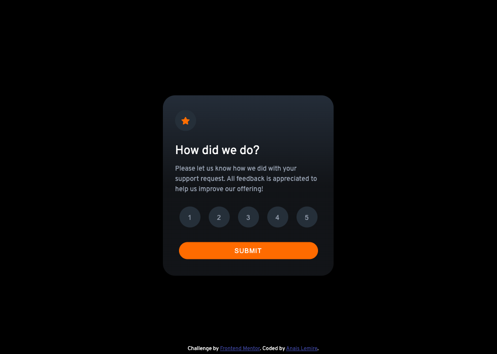

# Frontend Mentor - QR code component solution

This is a solution to the [QR code component challenge on Frontend Mentor](https://www.frontendmentor.io/challenges/qr-code-component-iux_sIO_H). Frontend Mentor challenges help you improve your coding skills by building realistic projects.

## Table of contents

- [Overview](#overview)
  - [Screenshot](#screenshot)
  - [Links](#links)
- [My process](#my-process)
  - [What I learned](#what-i-learned)
- [Author](#author)

## Overview

### Screenshot

### Links

- Solution URL: [https://anaislcno.github.io/Interactive-Rating-Component/]

## My process

### What I learned

I've done this challenge because it has been a long time since I last write something with just HTML, CSS and Js and I want to get back to basics before making progress.

## Author

- Website - [Anais Lemire](https://anaislemire.vercel.app/)
- Frontend Mentor - [@anaislcno](https://www.frontendmentor.io/profile/anaislcno)
